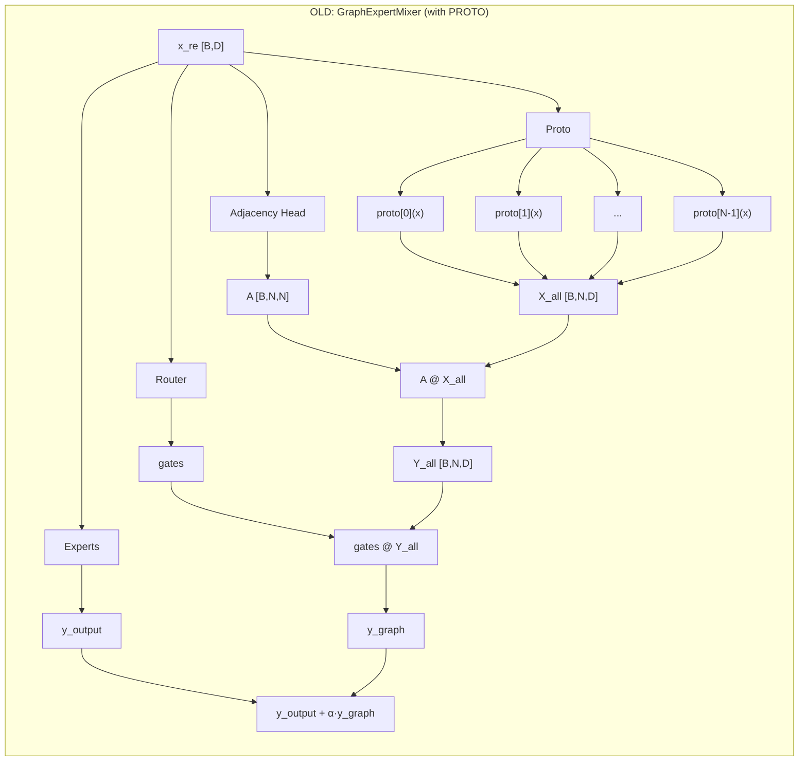
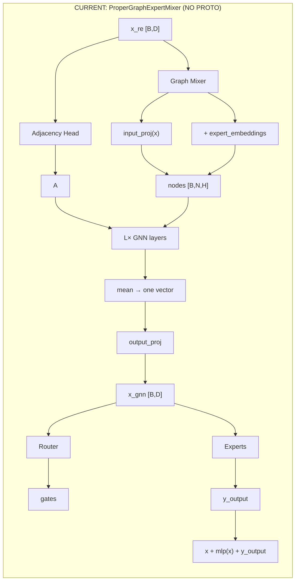

# Proto vs No-Proto: Diagram Explanation

Two ways the graph is used. ASCII diagrams below; Mermaid versions at the end (if your viewer supports Mermaid).

---

## Mermaid: OLD (with proto)



---

## Mermaid: CURRENT (no proto)



---

## OLD structure (WITH proto layer)

**Idea:** Router and experts run first. Then the graph builds **N different "expert views"** of the input (via N proto MLPs), mixes them, and **adds** that mix to the expert output (weighted by gates).

```
                    ┌─────────────────────────────────────────────────────────────────┐
                    │                    OLD STRUCTURE (GraphExpertMixer)               │
                    └─────────────────────────────────────────────────────────────────┘

  CLS token                                                                              
  x_re [B,D]                                                                             
       │                                                                                 
       ├──────────────────────────────┬───────────────────────────────────────────────┐
       │                              │                                                 │
       ▼                              ▼                                                 │
  ┌─────────┐                   ┌─────────────────────────────────────────────────┐   │
  │ Router  │                   │              GRAPH MIXER (uses PROTO)             │   │
  │         │                   │                                                   │   │
  │ gates   │                   │   x_re ──► ┌─────────────────────────────────────┐ │   │
  └────┬────┘                   │            │  PROTO LAYER (N small MLPs)        │ │   │
       │                        │            │  proto[0](x_re) → vec_0  [B,D]      │ │   │
       │                        │            │  proto[1](x_re) → vec_1  [B,D]      │ │   │
       │                        │            │  proto[2](x_re) → vec_2  [B,D]      │ │   │
       │                        │            │  ...                                 │ │   │
       │                        │            │  proto[N-1](x_re) → vec_{N-1} [B,D]  │ │   │
       │                        │            │  Stack → X_all [B, N, D]              │ │   │
       │                        │            └──────────────────┬──────────────────┘ │   │
       │                        │                               │                    │   │
       │                        │   x_re ──► Adjacency Head ──► A [B,N,N]             │   │
       │                        │                               │                    │   │
       │                        │            Message passing:    ▼                    │   │
       │                        │            Y_all = proj( act( A @ X_all ) )        │   │
       │                        │            Y_all [B, N, D]  (N vectors per sample) │   │
       │                        └───────────────────────────────┬─────────────────────┘   │
       │                                                        │                         │
       ▼                                                        ▼                         │
  ┌─────────┐                                              ┌─────────────┐                │
  │Experts  │                                              │ y_graph =   │                │
  │(use     │                                              │ gates @     │                │
  │ x_re)   │                                              │ Y_all       │                │
  └────┬────┘                                              │ [B,D]       │                │
       │                                                   └──────┬──────┘                │
       │                                                          │                       │
       ▼                                                          │                       │
  y_output [B,L,D]                                                │                       │
       │                                                          │                       │
       └────────────────────────── + alpha * y_graph ──────────────┘                       │
                                       │                                                     │
                                       ▼                                                     │
                              final = y_output + alpha * y_graph                            │
                                                                                            │
  So: PROTO LAYER = the N MLPs that turn one x_re into N vectors (X_all).                  │
  Without it, we have no "expert views" to put on the graph.                                │
```

**In one picture:**

```
     x_re [one vector]
          │
          ├──► Router ──► gates
          │
          ├──► Experts(x_re) ──► y_output
          │
          └──► Graph mixer:
                    │
                    ├──► PROTO: N MLPs  ──►  X_all [N vectors]
                    │         proto[i](x_re)
                    │
                    ├──► Adjacency Head ──►  A
                    │
                    └──► A @ X_all ──► Y_all [N vectors]
                              │
                              └──► y_graph = gates @ Y_all  ──► add to y_output
```

---

## CURRENT structure (NO proto layer)

**Idea:** The graph runs **first**. It turns the CLS token into **one** new vector **x_gnn**. Router and experts then use **x_gnn** (not x_re). There are no N proto-vectors; nodes are built from **one projection + expert embeddings**.

```
                    ┌─────────────────────────────────────────────────────────────────┐
                    │                 CURRENT STRUCTURE (ProperGraphExpertMixer)         │
                    └─────────────────────────────────────────────────────────────────┘

  CLS token                                                                              
  x_re [B,D]                                                                             
       │                                                                                 
       ▼                                                                                 
  ┌─────────────────────────────────────────────────────────────────────────────────┐   │
  │                         GRAPH MIXER (NO PROTO)                                   │   │
  │                                                                                  │   │
  │   x_re ──► input_proj ──► h [B, H]  (one vector for all nodes)                   │   │
  │                │                                                                  │   │
  │                │         expert_embeddings:  [N, H]  (one vector per expert)     │   │
  │                │                                                                  │   │
  │                └──────► Node i = h + expert_emb[i]   (same h + different embed)  │   │
  │                         Node features [B, N, H]  (no per-expert MLP!)             │   │
  │                                         │                                         │   │
  │   x_re ──► Adjacency Head ──► A [B,N,N] │                                         │   │
  │                                         │                                         │   │
  │                L layers:  Y = A @ X ──► Linear ──► Norm ──► Act  (repeat L times) │   │
  │                                         │                                         │   │
  │                Aggregate: mean over N ──► one vector [B, H]                       │   │
  │                                         │                                         │   │
  │                output_proj ──► x_gnn [B, D]  (single output)                       │   │
  └─────────────────────────────────────────┬───────────────────────────────────────────┘   │
                                            │                                                                 
                                            ▼                                                                 
                                       x_gnn [B,D]                                                             
                                            │                                                                 
                    ┌───────────────────────┴───────────────────────┐                         
                    ▼                                               ▼                         
             ┌──────────┐                                    ┌──────────┐                     
             │ Router   │                                    │ Experts  │                     
             │(x_gnn)   │                                    │(x_gnn)   │                     
             └────┬──────┘                                    └────┬─────┘                     
                  │                                                │                           
                  ▼                                                ▼                           
             gates                                                y_output                     
                  │                                                │                           
                  └──────────────────────┬───────────────────────┘                           
                                          ▼                                                     
                               final = x + mlp(ln(x)) + y_output                              
                               (no extra "y_graph" term; x_gnn was already used as input)     
                                                                                              
  So: NO PROTO = we build one x_gnn. Order is sequential: GNN → Router → Experts (not parallel).
```

**In one picture (order: sequential):**

```
     x_re  →  GNN  →  x_gnn  →  Router  →  gates  →  Experts(x_gnn, gates)  →  y_output
```

(Both Router and Experts use x_gnn; Router runs first to get gates, then Experts run.)

---

## Side-by-side summary

```
  ┌─────────────────────────────────────┬─────────────────────────────────────┐
  │  OLD (with proto)                    │  CURRENT (no proto)                │
  ├─────────────────────────────────────┼─────────────────────────────────────┤
  │                                      │                                      │
  │  x_re ──┬── Router ──► gates         │  x_re ──► Graph ──► x_gnn           │
  │         ├── Experts ──► y_output     │              │                      │
  │         └── Graph:                    │              ├── Router ──► gates   │
  │              proto(x_re) ──► N vecs  │              └── Experts ──► y_out   │
  │              A @ N vecs ──► Y_all    │                                      │
  │              gates @ Y_all ──► add    │  One path; no N vectors from graph. │
  │                 to y_output          │                                      │
  │                                      │                                      │
  │  Proto = N MLPs to get N vectors.   │  No proto = one proj + embeddings.   │
  └─────────────────────────────────────┴─────────────────────────────────────┘
```

---

## Why "proto" in the old design?

- **Proto** = each expert has a small MLP that maps the **same** input to one “expert view” vector. So you get **N vectors** (one per expert).
- The graph then mixes these N vectors (A @ X_all → Y_all). So the graph operates on **per-expert representations** of the input.
- In the **current** design, the graph does **not** need N different views. It only needs **one** output vector. So node features are built as “shared projection + expert id,” and there is **no proto layer**.


---

## Correct order: CLS → GNN → Router → Experts (sequential)

The **real order** is **sequential**, not parallel. Use this diagram for order:

```
  x [L,B,D]  →  x_re (CLS)  →  GNN  →  x_gnn  →  Router  →  gates  →  Experts  →  y_output [L,B,D]
                    [B,D]         [B,D]           [B,N]
```

**Single path (as in code):**

```
  x_re  →  GNN  →  x_gnn  →  Router(gates)  →  Experts(x_gnn, gates)  →  y_output
```

So: Router runs first, then Experts. One path.

---

## Why I previously drew Router and Experts "parallel"

**Execution order (sequential):**

```
  1. x_gnn = graph_mixer(x_re)
  2. gates = router(x_gnn)              ← router runs first
  3. dispatcher.dispatch(x_gnn, gates) ← gates decide which expert gets which token
  4. experts process their assigned inputs (still x_gnn, split by gates)
  5. combine(expert_outputs)
```

So: **router runs first** to produce gates; then the **dispatcher** uses those gates to split x_gnn and send chunks to experts; then **experts** run on those chunks. Execution is **sequential**, not parallel in time.

**Why they are "parallel" in data flow:**

- The **router** does not produce a new representation. It only produces **gates** (weights: which experts to use and how much).
- The **experts** do not take the router output as their input. They take **the same** x_gnn that the router used. The gates only decide **which expert sees which token** (routing), not **what** each expert sees (the content is still x_gnn).

So in the diagram we draw:

```
         x_gnn
           │
    ┌──────┴──────┐
    ▼             ▼
 Router       Experts
 (→ gates)    (→ y_output)
```

Both branches **start from** x_gnn. That is why I drew them side-by-side—to show they **share the same input**. But that picture is **misleading for order**: the actual order is **CLS → GNN → Router → Experts**. Use the sequential diagram above for order; the parallel picture only means "both use x_gnn."
